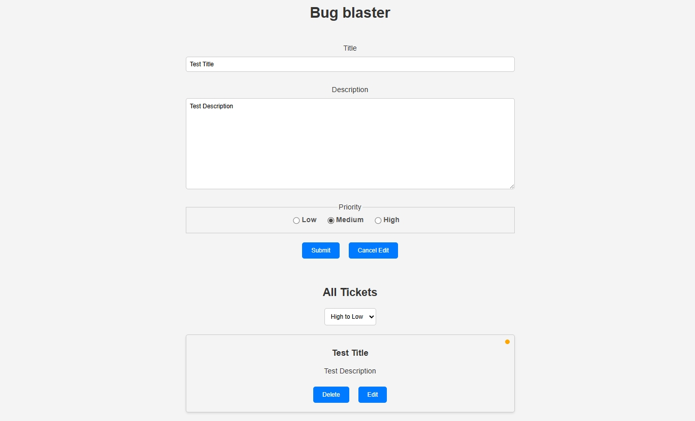

# 🐞 Bug Blaster

A simple React app for tracking and managing bug tickets!  
Easily add, edit, delete, and sort your tickets by priority.  
Built with [Create React App](https://github.com/facebook/create-react-app).

<p align="center">
  <br/>
  
</p>

---

## 🚀 Features

- ✍️ Add new bug tickets
- 📝 Edit existing tickets
- ❌ Delete tickets
- 🔼🔽 Sort tickets by priority (High to Low / Low to High)
- 🎨 Clean, responsive UI

---

## 📦 Project Structure

```
bug-blaster/
├── public/
│   ├── index.html
│   ├── favicon.ico
│   └── ...
├── src/
│   ├── components/
│   │   ├── TicketForm.js
│   │   ├── TicketItem.js
│   │   └── TicketList.js
│   ├── reducers/
│   │   └── ticketReducer.js
│   ├── utilities/
│   │   └── sortingUtilities.js
│   ├── App.js
│   ├── App.css
│   ├── styles.css
│   ├── index.js
│   └── ...
├── package.json
└── README.md
```

---

## 🛠️ Getting Started

1. **Clone the repo:**
   ```sh
   git clone https://github.com/your-username/bug-blaster.git
   cd bug-blaster
   ```

2. **Install dependencies:**
   ```sh
   npm install
   ```

3. **Start the development server:**
   ```sh
   npm start
   ```
   Open [http://localhost:3000](http://localhost:3000) in your browser.

---

## 🧪 Testing

Run tests with:
```sh
npm test
```
